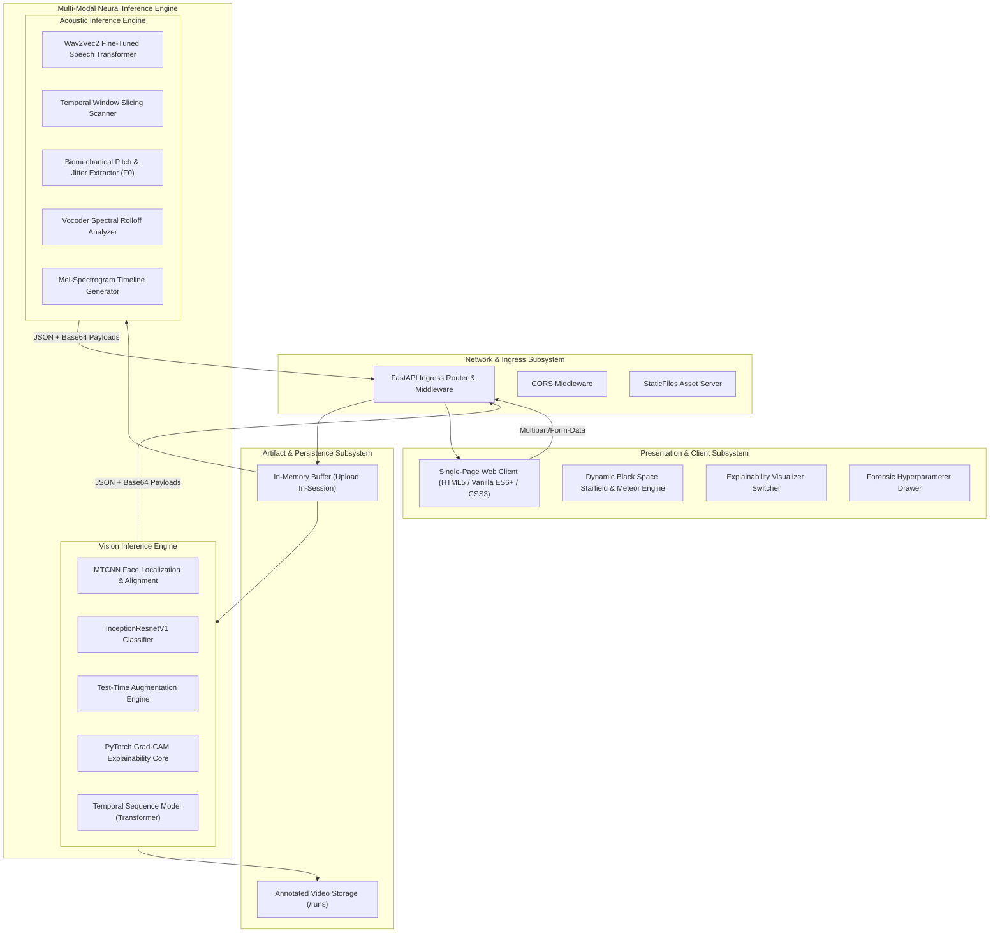
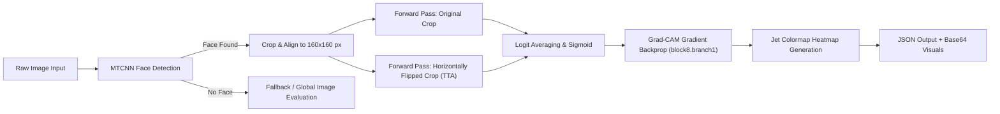
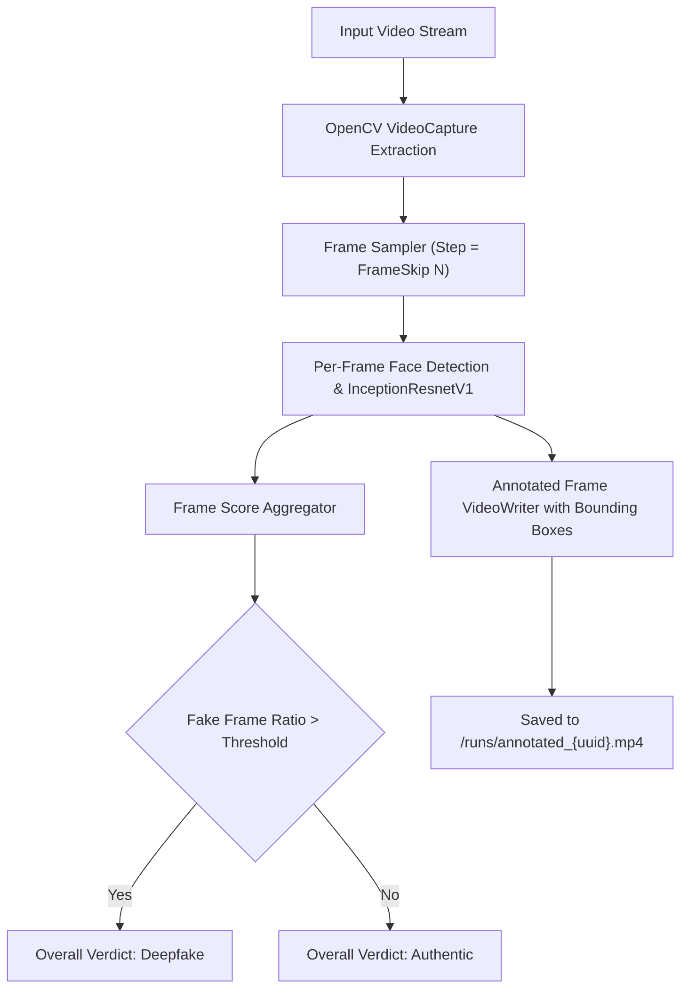
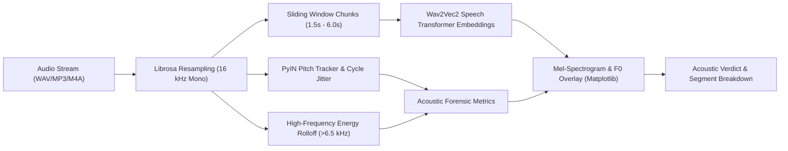
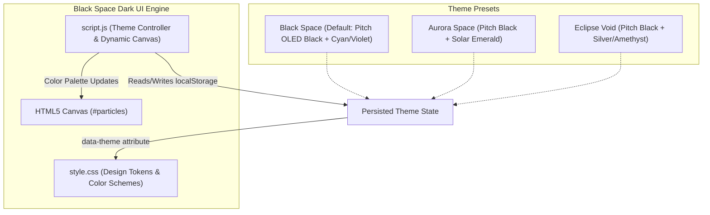

# 🏗️ Deepfake Detection AI — System Architecture Specification

This document provides the exhaustive architectural blueprint, subsystem specifications, data flow pipelines, and neural network topology definitions for the **Deepfake Detection AI** platform.

---

## 1. Architectural Overview & Design Principles

The platform follows a **decoupled, event-driven client-server architecture** designed for high throughput, low latency, and multi-modal forensic inspection.

### Core Design Principles
1. **Zero-Persistence Privacy:** Uploaded media files are processed in-session memory buffers and discarded immediately unless generating annotated video streams.
2. **Explainability First:** Raw binary classifications are paired with spatial (Grad-CAM) or temporal/frequency (Mel-spectrogram + Pitch Jitter) explainability metrics.
3. **Graceful Hardware Degradation:** Automatic runtime detection selects NVIDIA CUDA GPU cores when available and falls back smoothly to multithreaded CPU computation without crashing.
4. **Zero-Dependency Lightweight Client:** Frontend is built with pure standards-compliant HTML5, Vanilla JavaScript, and CSS3, eliminating heavyweight frameworks while maintaining 60 FPS rendering.

---

## 2. Multi-Modal Pipeline Specifications

### 2.1 Image Processing Pipeline

1. **Preprocessing:** Image decoded via `PIL.Image` and converted to RGB color space.
2. **Face Extraction:** MTCNN detects facial landmarks (eyes, nose, mouth corners) and crops bounding boxes with a 20% margin.
3. **Inference & TTA:**
   $$\text{Prediction} = \frac{1}{2}\left[\sigma(M(I_{\text{crop}})) + \sigma(M(\text{flip}(I_{\text{crop}})))\right]$$
4. **Grad-CAM Computation:**
   $$L_{\text{Grad-CAM}}^c = \text{ReLU}\left(\sum_k \alpha_k^c A^k\right), \quad \text{where } \alpha_k^c = \frac{1}{Z}\sum_i\sum_j \frac{\partial Y^c}{\partial A_{i,j}^k}$$

---

### 2.2 Video Temporal Forensic Pipeline

- **Frame Sampler:** Decodes video at native frame rate, selecting every $N$-th frame (configurable 1–25, default 5) for optimal performance.
- **Annotation Engine:** Overlays real-time bounding boxes (Green for Authentic, Red for Manipulated) and confidence scores on frames, writing output via `cv2.VideoWriter`.

---

### 2.3 Audio & Voice Forensic Pipeline

1. **Acoustic Standardization:** Audio decoded to 32-bit floating point, converted to single-channel mono, resampled to 16,000 Hz, and peak-normalized.
2. **Transformer Embedding:** HuggingFace `AutoFeatureExtractor` converts raw waveforms into contextualized latent vectors processed by `AutoModelForAudioClassification`.
3. **Biomechanical Indicators:**
   - **Fundamental Frequency ($F_0$):** Extracted using probabilistic YIN (`librosa.pyin`).
   - **Jitter:** Standard deviation and relative perturbations across adjacent vocal cycles. Synthetic speech models struggle to replicate organic micro-vibrations.
   - **Vocoder Cutoff:** Evaluates energy distribution above 6.5 kHz to identify synthetic neural vocoder limits.

---

## 3. Subsystem Specifications & Hardware Interfaces

### Execution Hardware Modes
| Target Device | Detection Logic | Expected Inference Speed |
| :--- | :--- | :--- |
| **CUDA GPU (NVIDIA)** | `torch.cuda.is_available()` returns `True` | ~40–70 ms / image; ~1.2s / 10s video |
| **CPU (Intel / AMD)** | Fallback mode with multi-threading | ~250–500 ms / image; ~4–8s / 10s video |

### Network & API Layer
- **Port:** `8000` (default)
- **Protocols:** HTTP/1.1, WebSocket-ready
- **Static Assets:** Handled through FastAPI `StaticFiles` mounted at `/`

---

## 4. UI Architecture & Theme Engine

- **Color Tokens:**
  - Background Body: `#000000` (True pitch-black space void)
  - Surface Glass: `rgba(7, 9, 18, 0.82)` with `backdrop-filter: blur(20px)`
  - Accents: Electric Cyan (`#00f2fe`), Quantum Violet (`#8a2be2`), Supernova Pink (`#ff2a85`)
- **Typography:**
  - Display: `Space Grotesk` (Google Fonts)
  - Body: `Plus Jakarta Sans` (Google Fonts)
  - Monospace Data: `JetBrains Mono` (Google Fonts)
- **Canvas Features:**
  - 130+ dynamic stars with parallax depth and 4-point pulsar lens flares
  - Interactive constellation line rendering
  - Timed meteor shooting star generation
  - Mouse coordinate gravitational repulsion

---

## 5. Security, Resilience & Privacy Governance

1. **Payload Size Restrictions:** Max upload size constrained to 50 MB to prevent denial-of-service via resource exhaustion.
2. **Format Whitelisting:** Strict mime-type and extension validation for Images (`.jpg`, `.jpeg`, `.png`, `.webp`), Videos (`.mp4`, `.avi`, `.mov`, `.webm`), and Audio (`.wav`, `.mp3`, `.m4a`, `.flac`).
3. **Session Cleansing:** Video outputs generated in `runs/` are referenced by randomly generated UUIDs (`uuid.uuid4()`) and can be automatically cleared by administrative cron tasks.
