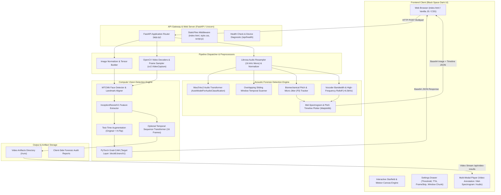
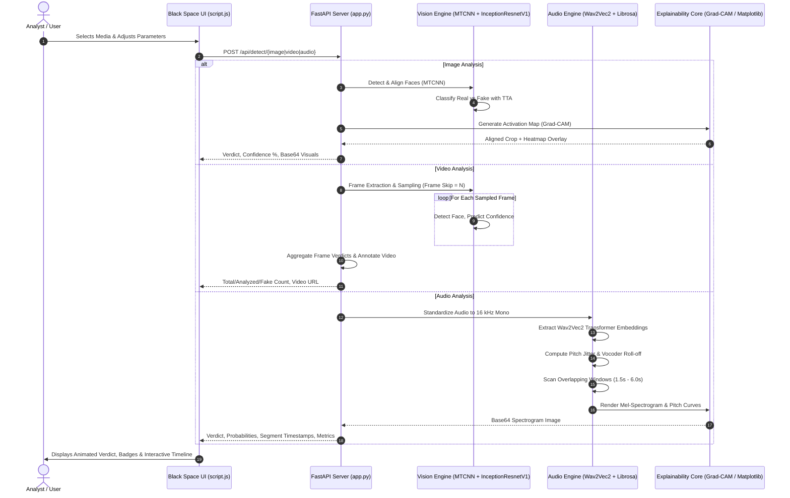

# 🌌 Deepfake Detection AI — Multi-Modal Forensic Platform


> **State-of-the-Art Deepfake Media Detection System for Images, Videos, and Voice Recordings with Explainable AI & Dynamic Black Space Interface.**

[](https://fastapi.tiangolo.com)
[](https://www.python.org/)
[](https://pytorch.org/)
[](https://huggingface.co/)
[](#ui-and-design-system)

---

## 📑 Table of Contents
1. [Overview](#-overview)
2. [System Architecture](#-system-architecture)
   - [High-Level Architecture Diagram](#high-level-architecture-diagram)
   - [Pipeline Data Flow](#pipeline-data-flow)
   - [Core Component Breakdown](#core-component-breakdown)
3. [Deep Learning & Forensic Models](#-deep-learning--forensic-models)
   - [1. Facial Image Forensics (MTCNN + InceptionResnetV1)](#1-facial-image-forensics-mtcnn--inceptionresnetv1)
   - [2. Explainable AI: Grad-CAM Heatmaps](#2-explainable-ai-grad-cam-heatmaps)
   - [3. Frame-by-Frame Video Forensics](#3-frame-by-frame-video-forensics)
   - [4. Synthetic Speech & Audio Forensics (Wav2Vec2)](#4-synthetic-speech--audio-forensics-wav2vec2)
4. [UI and Design System (Dynamic Black Space Dark)](#-ui-and-design-system)
5. [API Specification](#-api-specification)
6. [Project File Structure](#-project-file-structure)
7. [Getting Started & Installation](#-getting-started--installation)
8. [Configuration & Parameters](#-configuration--parameters)

---

## 🔭 Overview

The **Deepfake Detection AI** platform provides automated, multi-modal forensic inspection to expose synthetically generated, face-swapped, and AI-manipulated media. The system operates across three primary modalities:
- **🖼️ Images:** High-resolution face detection, facial alignment, neural feature extraction, and Grad-CAM visual heatmaps.
- **🎥 Videos:** Adaptive temporal sampling, frame-by-frame face analysis, decision aggregation, and downloadable annotated video playback.
- **🎙️ Audio & Voice:** Transformer-based speech classification (Wav2Vec2), overlapping sliding window scanning, pitch micro-jitter analysis, vocoder spectral cutoff inspection, and mel-spectrogram visual timelines.

---

## 🏛️ System Architecture

### High-Level Architecture Diagram



---

### Pipeline Data Flow



---

### Core Component Breakdown

| Component | File | Responsibilities | Key Libraries |
| :--- | :--- | :--- | :--- |
| **API Server & Routing** | `app.py` | REST API endpoints, multipart file handling, static file mounting, background processing. | `fastapi`, `uvicorn`, `pydantic` |
| **Vision Detection Pipeline** | `app.py` | MTCNN face detection/cropping, InceptionResnetV1 classification, TTA averaging, frame-by-frame video processing. | `facenet-pytorch`, `torch`, `cv2`, `PIL` |
| **Visual Explainability** | `app.py` | PyTorch Grad-CAM calculation on deep feature layers, heatmap blending. | `pytorch-grad-cam`, `numpy` |
| **Audio Forensics Engine** | `audio_model.py` | Wav2Vec2 inference, sliding chunk window detection, acoustic feature extraction (F0 jitter, vocoder cutoff). | `transformers`, `librosa`, `soundfile`, `matplotlib` |
| **User Interface** | `index.html` | Semantic layout, glassmorphic cards, multi-modal upload tabs, interactive result visualizers, audio player. | Modern HTML5 |
| **Design System & Theme** | `style.css` | Dynamic Black Space Dark design tokens, modern typography pairings, glassmorphism, responsive grid. | Vanilla CSS3 |
| **Interactive Logic** | `script.js` | Dynamic space starfield & meteor engine, theme switcher, API fetch handler, visualizer tab switcher, report exporter. | Vanilla JavaScript (ES6+) |

---

## 🧠 Deep Learning & Forensic Models

### 1. Facial Image Forensics (MTCNN + InceptionResnetV1)
- **Face Localization:** Multi-task Cascaded Convolutional Networks (MTCNN) identifies facial boundaries, standardizes resolution to 160×160 pixels, and normalizes orientation.
- **Backbone Network:** InceptionResnetV1 pretrained on VGGFace2 and fine-tuned for facial manipulation artifact detection.
- **Test-Time Augmentation (TTA):** The model evaluates both the original face crop and its horizontal reflection, averaging the output logits to reduce directional bias and false positives:
  $$\hat{y} = \frac{1}{2}\left(\sigma(f(x)) + \sigma(f(\text{flip}(x)))\right)$$

### 2. Explainable AI: Grad-CAM Heatmaps
- Uses **Gradient-weighted Class Activation Mapping (Grad-CAM)** on the final convolutional layer (`block8.branch1`).
- Highlights spatial activation gradients corresponding to the manipulated class, projecting warmer colors (red/orange) onto unnatural blending boundaries, digital seamlines, and GAN warping artifacts.

### 3. Frame-by-Frame Video Forensics
- Employs an adaptive frame sampling mechanism via a configurable `frame_skip` parameter (1 to 25).
- Each sampled frame undergoes MTCNN facial extraction and neural classification.
- Aggregated metrics include:
  - Total frames & analyzed frame counts
  - Deepfake vs authentic frame distribution
  - Overlap with temporal coherence transformer model (when enabled)
  - Annotated output video generated in `runs/` with bounding boxes and forensic tags.

### 4. Synthetic Speech & Audio Forensics (Wav2Vec2)
- **Speech Transformer:** HuggingFace `AutoModelForAudioClassification` using fine-tuned `Wav2Vec2` representations.
- **Biomechanical Micro-Jitter ($F_0$):** Biological human vocal cords exhibit natural, subtle pitch micro-perturbations. In contrast, text-to-speech (TTS) vocoders and voice-cloning algorithms often produce robotic pitch rigidity or mathematical over-smoothing:
  $$\text{Jitter} = \frac{\frac{1}{N-1}\sum_{i=1}^{N-1}|T_i - T_{i+1}|}{\frac{1}{N}\sum_{i=1}^{N}T_i}$$
- **Vocoder High-Frequency Cutoff:** Measures spectral energy above 6.5 kHz. Neural vocoders (HiFi-GAN, MelGAN) often demonstrate unnatural high-frequency attenuation.
- **Temporal Splicing Scan:** Evaluates overlapping sliding windows (1.5s - 6.0s) to detect injected synthetic sentences spliced into authentic conversations.

---

## 🎨 UI and Design System

The application features a **Dynamic Black Space Dark** aesthetic engineered for visual elegance and operational clarity:

### Typography Architecture
- **Display & Headings:** `Space Grotesk` — Geometric, futuristic sans-serif for logos, titles, and hero branding.
- **Body & Controls:** `Plus Jakarta Sans` — Clean, highly legible modern typeface for paragraphs, forms, and instructions.
- **Technical & Metric Readouts:** `JetBrains Mono` — High-tech monospace typeface for confidence percentages, latency values, format chips, and timestamps.

### Dynamic Space Themes
1. **🌌 Black Space (Default):** True OLED pitch-black void (`#000000`) with electric cyan (`#00f2fe`) and quantum violet (`#8a2be2`) pulsar accents.
2. **⚡ Aurora Space:** Pitch-black background illuminated by solar emerald (`#00f59b`) and starlight cyan winds.
3. **🪐 Eclipse Void:** Ultra-deep cosmic obsidian with silver starlight and amethyst (`#c084fc`) highlights.

### Interactive Cosmic Engine
- **Multi-Tier Starfield:** 130+ dynamic stars with parallax depth, random twinkle cycles, and 4-point pulsar lens flares.
- **Constellation Web:** Responsive constellation lines drawn between proximate stars with distance-based alpha attenuation.
- **Shooting Stars (Meteors):** Realistic meteors streaking across the sky at random intervals with decaying gradient tails.
- **Mouse Reactivity:** Interactive gravitational deflection reacting to cursor movement.

---

## 🔌 API Specification

### `GET /api/health`
Checks engine status, active device (CUDA GPU or CPU), and loaded models.
```json
{
  "status": "online",
  "device": "cuda:0",
  "temporal_model_available": true,
  "audio_model_available": true
}
```

### `POST /api/detect/image`
Upload an image for deepfake face analysis and Grad-CAM visualization.
- **Parameters:** `file` (UploadFile), `threshold` (float, default `0.5`), `use_tta` (bool, default `true`).
- **Response:**
```json
{
  "status": "success",
  "label": "Fake",
  "confidence": 98.4,
  "is_deepfake": true,
  "threshold_used": 0.5,
  "tta_used": true,
  "device": "cuda:0",
  "processing_time": 0.142,
  "visualizations": {
    "original": "data:image/jpeg;base64,...",
    "face": "data:image/jpeg;base64,...",
    "cam": "data:image/jpeg;base64,..."
  }
}
```

### `POST /api/detect/video`
Upload a video file for frame-by-frame deepfake inspection.
- **Parameters:** `file` (UploadFile), `frame_skip` (int, default `5`), `threshold` (float, default `0.5`), `use_temporal` (bool).
- **Response:**
```json
{
  "status": "success",
  "label": "Fake",
  "confidence": 94.2,
  "total_frames": 240,
  "analyzed_frames": 48,
  "fake_frames": 44,
  "real_frames": 4,
  "annotated_video_url": "/api/video-results/annotated_uuid.mp4"
}
```

### `POST /api/detect/audio`
Upload an audio file for speech deepfake detection, forensic feature extraction, and spectrogram timeline.
- **Parameters:** `file` (UploadFile), `threshold` (float, default `0.5`), `chunk_duration` (float, default `3.5`).
- **Response:**
```json
{
  "status": "success",
  "label": "Synthetic / Fake Voice",
  "confidence": 96.8,
  "fake_prob": 96.8,
  "real_prob": 3.2,
  "forensic_metrics": {
    "mean_f0_hz": 184.2,
    "pitch_jitter": 0.0048,
    "high_freq_energy_ratio": 0.012,
    "spectral_centroid_hz": 1920.4,
    "silence_ratio": 0.14,
    "spliced_segments_count": 2
  },
  "segment_results": [
    { "start_sec": 0.0, "end_sec": 3.5, "is_fake": false, "fake_prob": 12.4 },
    { "start_sec": 2.0, "end_sec": 5.5, "is_fake": true, "fake_prob": 98.1 }
  ],
  "plot_image": "data:image/png;base64,..."
}
```

---

## 📂 Project File Structure

```text
Deepfake Detection/
├── app.py                 # FastAPI backend, routing, computer vision & Grad-CAM pipeline
├── audio_model.py         # Wav2Vec2 transformer & acoustic forensic indicator analysis
├── index.html             # Black Space Dark user interface layout
├── style.css              # Black Space Dark theme styling & typography definitions
├── script.js              # Space starfield canvas engine, theme switcher, & client API calls
├── run.bat                # Windows launch script
├── run.ps1                # PowerShell automated execution script
├── runs/                  # Directory containing processed and annotated video results
└── README.md              # Project documentation & system architecture blueprint
```

---

## 🚀 Getting Started & Installation

### Prerequisites
- Python 3.10 or higher
- NVIDIA CUDA-capable GPU (recommended, fallback to CPU is automatic)
- Modern web browser (Chrome, Edge, Firefox, Brave)

### 1. Clone the Repository
```bash
git clone https://github.com/Chamansengar/Deepfake-Detection-Using-Ai-Frontend-.git
cd "Deepfake Detection"
```

### 2. Set Up Virtual Environment
```bash
python -m venv .venv
# On Windows:
.venv\Scripts\activate
# On Linux/macOS:
source .venv/bin/activate
```

### 3. Install Dependencies
```bash
pip install fastapi uvicorn python-multipart torch torchvision facenet-pytorch pytorch-grad-cam opencv-python Pillow librosa soundfile transformers matplotlib numpy
```

### 4. Run the Application
You can run the web server using PowerShell:
```powershell
.\run.ps1
```
Or directly with Uvicorn:
```bash
uvicorn app:app --host 127.0.0.1 --port 8000 --reload
```

### 5. Access the Web Application
Open your browser and navigate to:
- **Web UI:** [http://127.0.0.1:8000](http://127.0.0.1:8000)
- **Interactive API Documentation:** [http://127.0.0.1:8000/docs](http://127.0.0.1:8000/docs)

---

## ⚙️ Configuration & Parameters

The UI includes an interactive **Settings Drawer** that lets analysts tune detection parameters in real time:
- **Decision Threshold (0.10 - 0.90):** Adjust sensitivity. Lower values make the detector strict against potential fakes; higher values prioritize authentic media.
- **Test-Time Augmentation (TTA):** Toggles horizontal flip ensemble averaging for higher prediction stability.
- **Frame Skip (1 - 25):** Controls video sampling rate. Lower values provide exhaustive analysis; higher values accelerate throughput.
- **Temporal Window Chunk (1.5s - 6.0s):** Controls sliding window duration for speech splice detection.

---

## 📜 License & Ethical Notice
This project is developed for educational, verification, and forensic research purposes to combat digital misinformation and protect media authenticity.
